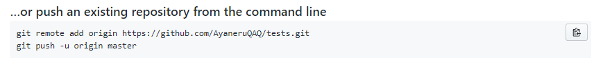
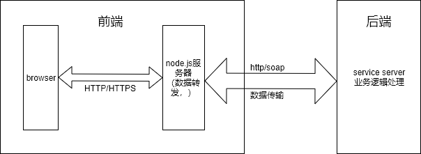
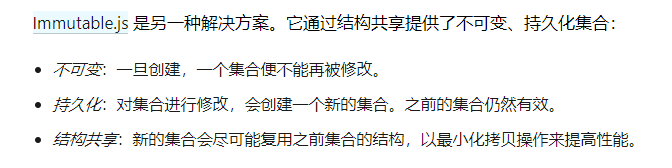
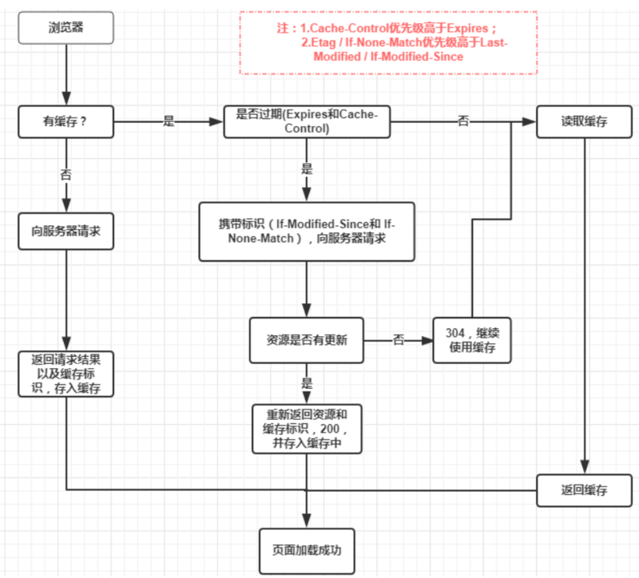
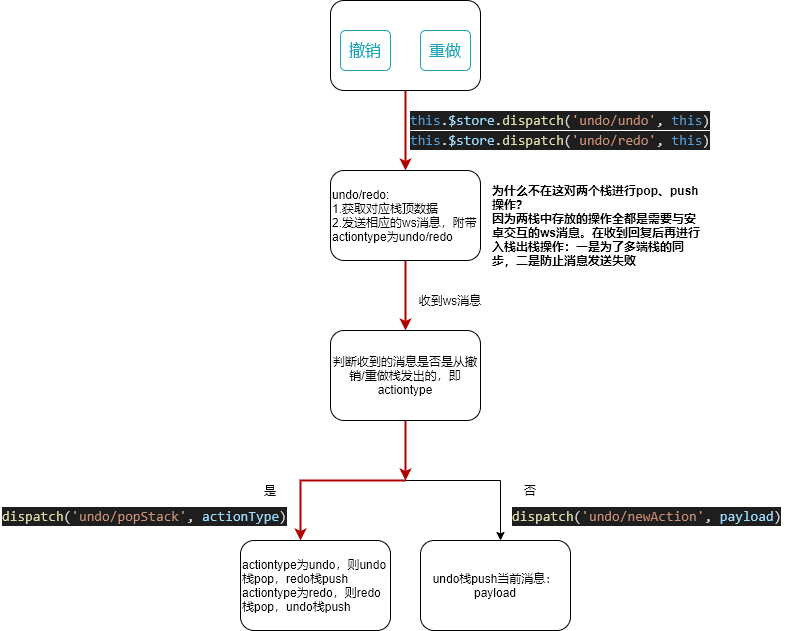

# JS笔记

###### 1.js输出：

document.write()仅用作测试，且在文档加载完成后执行会删除所有页面内容。

###### **2**.js加法

如下`var x="2"+1+1`，结果为211；`var x=1+1+"2"`，结果为22。（字符串➕数字，返回结果为字符串）。

###### 3.字符串与数字比较

会把字符串转换为数值，空字符串将被转换为 0。非数值字符串将被转换为始终为 false 的 NaN

###### 4.jquery选择器

class选择器`$('.class')` 	id选择器`$('#id')`		标签选择器`$('button')`

###### 5.js string转int

`var i = parseInt(“20”)`

###### 6.判断一个变量是否为`NaN`

`!(test == test)`若返回结果为`true`，则test是`NaN`

###### 7.js除法强制取2位小数

```js
        function toDecimal2(x) {//除法保留2位
            var f = parseFloat(x);
            if (isNaN(f)) {
                return false;
            }
            var f = Math.round(x * 100) / 100;
            var s = f.toString();
            var rs = s.indexOf('.');
            if (rs < 0) {
                rs = s.length;
                s += '.';
            }
            while (s.length <= rs + 2) {
                s += '0';
            }
            return s;
        }
```

###### 8.DOM元素的id值是唯一的

###### 9.获取url特定name的参数值

​	location.search：**如果“#”之前没有“？”search取值为空**

```js
//没有#的路径可以使用下面的函数	
function getFrom(name){
		var reg = new RegExp("(^|&)" + name + "=([^&]*)(&|$)");  
		var r = location.search.substr(1).match(reg); //location.search获取？后的内容
		return r ? unescape(decodeURI(r[2])) : null ;
	}
	
```

```javascript
//通用的方法
    let r;
    let url = window.location.toString();
    let ur = url.split(/[#?=&]/);//
    for(let i = 0;i < ur.length;i++){
        if(ur[i]==='imei'){
             r = ur[i+1];
             console.log(r);
        }
    }
```

###### 10.按分钟倒计时显示，也要1秒执行一次倒计时函数！！！！

###### 11.ajax的send（），只在post请求时才需要参数

###### 12.原生js设置style

```javascript
var pay1 = document.getElementsByClassName("pay");
document.body.style.backgroundColor = "white";
document.documentElement.style.backgroundColor = "white";//设置html背景色
pay1[0].style.color = "black";
```

###### 13.react事件绑定传参

​	使用es6箭头函数

```jsx
onClick={()=>this.button_Click(参数)}
```

###### 14.url传#等特殊参数时要做转义

​	例：# => %23

###### 15.判断第一次打开页面

```js
        if(sessionStorage.getItem("firstopen")){//null
            sessionStorage.setItem("firstopen","0")
            // console.log("96"+sessionStorage.getItem("firstopen"))
        }else{
            sessionStorage.setItem("firstopen","1")
            // console.log("99"+sessionStorage.getItem("firstopen"))
        }
```

**第一次**：打开整个网站第一次，关掉页面再打开还是判断为第一次。其余情况，例如路由跳转到首页则不为第一次

###### 16.js数组深拷贝、浅拷贝

​	

```js
let b= JSON.parse(JSON.stringify(a))//使用json方法实现深拷贝

stringify() js对象转化成JSON字符串
parse() 字符串转化成对象

//es6实现数组深拷贝
let a1 = [1,2,3]
let a2 = [...a1]
//可以下面这样使用
                                   
//如果数组所有项都为非引用类型，则slice(0)可以视作深拷贝，反之则不行
```

###### 16.concat不改变原数组

```
let a = [1,2,3]
a.concat(4)
//此时a=[1,2,3],没有改变
```

​	**splice()会改变原数组**

###### 17.input框绑定键盘enter事件

```jsx
onKeyDown={
    (e) => {
            if (e.keyCode == '13') {
                   this.search();
                   console.log('enter')
            }
          }
}
```

###### 18.es6寻找符合条件的数组项下标

```
array.findIndex(这里填条件)

array.indexOf(item)//返回下标
```

###### 19.js数据类型：

​	基本数据类型：String、Number、Boolean、Null、Undefined

​	引用数据类型：Object、Array、Function

​	typeof返回的数据类型有string、number(NaN)、boolean、undefined、object（null、array）、function

###### 20.array.reduce(func,initvalue)

###### 21.全局变量

```js
let/const a = 123 //在class里直接使用
var b = 123 //在class里要通过this.b来使用
```

###### 22.数组解构按次序，对象解构按属性名

**解构赋值的规则是，只要等号右边的值不是对象或数组，就先将其转为对象**

###### 23.for...of和foreach遍历数组，foreach不可中途跳出，而前者可以配合break、return使用

###### 24.call/apply/bind,让this指针指向传递的第一个参数，如果第一个参数为空，则指向全局变量

call/apply 临时改变 `this` 指向，且会立即执行, apply 第二个参数是数组，包含所有传入函数的参数

bind 返回一个改变 `this` 指向的函数，不立即执行


**下面是两个简略版实现**

手写 call/apply

```js
Function.prototype.myCall = function (target,...arg){
	target = target || window
  target.fn = this // 即把函数赋值为目标对象的一个属性
  const res = target.fn(...arg) // 执行函数
  delete target.fn // 因为是call是一次性的，所以执行完成后删除该属性
  return res
}
```


手写 bind

```js
Function.prototype.myBind = function (target,...arg) {
  target = target || {}
  target.fn = this
  return function (...arg1) {
  	target.fn(...arg,...arg1)
	}
}
```


###### 25.js中数组成员的类型可以是不一致的

```js
let arr = [1,'1']
typeof(arr[0])//number
typeof(arr[1])//string
```

###### 26.let self = this

​	普通函数中this指向window对象

```js
function a(){
	this.name = "hello"; 
 
	function b(){  //b只是一个普通函数，不是a的属性方法
		alert(this.name);
	}
	b();  //调用b
}

new a(); //新建一个a对象，此时alert name undefined
```

```js
function a(){
	var self = this;
	this.name = "hello"; 
 
	function b(){  //b只是一个普通函数，不是a的属性方法
		alert(self.name);
	}
	b();  //调用b
}
 
new a(); //新建一个a对象，此时alert name = hello
```

```js

var param = "hello";
var myObject = {
  param: 123,
  method: function(){
    alert( this.param );  //this指向myObject，因为这个函数是对象的属性
  },
  method2: function(){
    setTimeout(function(){  //匿名函数
      alert( this.param ); //this指向windows
    },100);
  }
}
myObject.method(); //alert 123
myObject.method2();  //alert hello
```

###### 27.尽量少用全局变量，因为js内存回收机制难以判断什么时候可以回收全局变量

​	内存泄漏：创建了无法回收的对象

###### 28.js内存空间

​	栈：存基本数据类型和指向复杂数据类型的指针

​	堆：复杂数据类型（对象、数组、函数）

###### 29.lodash中有很多好用的方法

​	函数防抖debounce

​	函数节流throttle

​	[](https://blog.csdn.net/duola8789/article/details/78871789)

###### 30.Promise对象

```js
let promise = new Promise()
promise
.then(result => {···})
.catch(error => {···})//catch捕获rejection
.finally(() => {···});
```

###### 31.async/await:generator函数的语法糖

​	内置执行器，不需要next

​	返回Promise对象

​	await后面不一定要Promise对象

###### 31.Image()

​	js中缓存图片,预加载

```js
 function loadimg (){//在需要显示图片的时候执行该函数
                var tmpt = document.getElementById('cs');
                var oimg = new Image();
                oimg.onload = function(){
                    tmpt.src = oimg.src;
                }
                oimg.src = 'wx.png';
                
            }
```

###### 32.闭包：在一个函数内创建另一个函数

​	闭包可用来模拟私有方法（模块模式）

###### 33.原型链（`__proto__`指针链）

​	**prototype**（原型）是函数特有的属性

​	`__proto__`是所有对象都有的属性


动态改变继承的值

```js
function Employee () {
  this.dept = "general";
}
Employee.prototype.name = "";

function WorkerBee () {
  this.projects = [];
}
WorkerBee.prototype = new Employee;

var amy = new WorkerBee;

Employee.prototype.name = "Unknown";
amy.name = 'unknown'
```

在访问一个对象的属性时，JavaScript 将执行下面的步骤：

1. 检查对象自身是否存在。如果存在，返回值。

2. 如果本地值不存在，检查原型链（通过 `__proto__` 属性）。//递归检查

   //`__proto__`指向继承对象的 prototype

3. 如果原型链中的某个对象具有指定属性，则返回值。

4. 如果这样的属性不存在，则对象没有该属性，返回 undefined。

检查一个对象是否具有自己定义的属性，使用`hasOwnProperty`函数


使用`class`定义的类：其中的方法相当于定义在这个类的 `prototype ` 上


###### 34.generator函数：能够return多次的函数

​	定义：

```js
function* foo(x){
    yield x+1;
    yield x+2;
    return x+3;//return要在最后，否则return后面的yield不能返回
}
```

​	调用：yield阻塞函数执行，next恢复执行

```js
let a = foo(1);
a.next();//{value: 2, done: false}
a.next();//{value: 3, done: false}
a.next();//{value: 4, done: true}
a.next();//{value: undefined, done: true}
```

​	或：

```js
for (let x of foo(1)){
    console.log(x)//2,3。不会打印出return的内容
}
```

在一个generator函数中执行另一个generator函数

```js
function* foo(){
	yield 'aa';
}

function* bar(){
	yield* foo();
    yield 'bb';
}
for(let val of bar()){
    console.log(val);//aa,bb
}
```

​	yield用在另一个表达式中要加（）

​	`let str = 'hello'+(yield 123)`


generator函数自动执行模块：co

```js
var co = require('co')
co(foo);//返回Promise对象

co(foo).then(()=>{
	//some code
})
```

###### 35.箭头函数嵌套(类似闭包)

```js
let add = (a)=>(b)=>a+b
let add = function(){
    
}
add(1)(2)//3

```

###### 36.form的onSubmit会默认刷新页面，使用e.preventDefault()可以阻止自动刷新

###### 37.手动用Promise封装XMLHttpRequest

```js
const url = 'http://localhost:3000'

function ajax(method,suffix,data){
    return new Promise(function(resolve,reject){
        const handler = function(){
            if(xhr.readyState !== 4){
                return
            }
            if(xhr.status === 200){
                resolve(xhr.responseText)
            }else{
                reject()
            }
        }
        let xhr = new XMLHttpRequest()
        xhr.open(method,url+suffix)
        xhr.setRequestHeader('Content-Type','application/json;charset=utf-8')
		xhr.send(data)
        xhr.onreadystatechange = handler
    })
}

ajax('GET','/user','').then().catch()
```

###### 38.字符串加数字：把数字转成字符串拼接；字符串减数字：把字符串转成数字运算

```js
'11'+1 //'111'
'11'-1 //10
```

###### 39.js的addEventListener与removeEventListener

```js
window.addEventListener('scroll',this.handleScroll)
//等同于onScroll
window.removeEventListener('scroll',this.handleScroll)
//移除事件监听的时候要指定后面的函数，否则不行。因此add的时候不能使用匿名函数
```

###### 40.es6动态改变元素类名

```jsx
<div className={`test ${tiaojian?'active':''}`}></div>
```

###### 41.js判断数组维度

一维二维

```js
const tf = arr => arr.some(item=> item instanceof Array)
tf(arr)//true则为二维数组

Array.some()//只要数组中有一个满足条件就返回true，不继续对剩下的元素执行	
```

判断任意维

```js
function dimension(arr){
	if(arr instanceof Array){
        return Math.max(...arr.map(e=>{
            return 1+dimension(e)
        }))
    }else{
        return 0
    }
}
```

###### 42.setTimeout(function,1000)，function一定不能立即执行，即不能加（）
###### 42.类装饰器

```typescript
// 装饰器的原理
@decorator
class A {}

//等同于

class A {}
A = decorator(A) || A;
```

###### 43.n维数组降维

`let arr = [1,2,7,3,[3,4,[5,4,6]]]`

```js
Array.from(new Set(arr.flat(Infinity)))//降维去重
```

或

```js
function flatten(arr1){
	return arr1.reduce((r,item)=>Array.isArray(item)?r.concat(flatten(item)):r.concat(item),[])
}

Array.from(new Set(flatten(arr)))
```

###### 44.数组排序

```js
Array.from(new Set(flatten(arr))).sort((a,b)=>{return a-b})
//[1,2,3,4,5,6,7]
```

###### 45.[object] instanceof [构造函数]

​	若左侧为基本类型，则直接返回false，例如：`1 instanceof Number`，结果为false

###### 46.typeof 返回一个字符串，表明类型（只能判断基本数据类型）

​	注意：

```js
typeof [1,2,3] //"object"
typeof null //"object"
```

###### 47.各种循环break

```js
let a = [1,2,3,4,5,6]
//不会break
a.forEach(item=>{
  if(item ===3){
    return
  }
  console.log(item)
})

//可以break
for(let i = 0;i<a.length;i++){
  if(a[i] === 3){
    break
  }
  console.log(a[i])
}
//可以break
a.every(item=>{
  if(item ===3){
    return false
  }else{
    console.log(item) 
    return true
  }
})
//可以break
a.some(item=>{
  if(item ===3){
    return true
  }
  console.log(item)//1，2，true
})

```

###### 48.js删除对象的某一属性

```js
let obj = {
	attr1:11
}
delete obj.attr1
//最好按以下方式设置
obj.attr1 = ''  
```

###### 49.es6的单例写法

```js
class Db {
    //ES6类的静态方法（只能直接由类名调用的方法）：static getInstance
    //ES6类的静态属性：直接挂载在类名上的方法，如：Db.instance()
    static getInstance() {
        if (!Db.instance) {
            Db.instance = new Db();
            return Db.instance
        }
        return Db.instance;
    }
    constructor(name, age) {
        this.name = name;
        this.age = age;
        //在constructor里面可以初始化地（对象一创建就开始）运行对象的方法
        this.connect()
    }
    connect() {
        console.log("I am sillyB,我连接上了数据库")
    }
    find() {
        console.log("查询数据库")
    }
}
//单例模式创建对象时，不再使用类直接创建对象，而是使用类名调用类的静态方法来创建（或返回）对象
var db1 = Db.getInstance()
var db2 = Db.getInstance()
var db3 = Db.getInstance()
db1.find()
db2.find()
db3.find()
/*结果：
I am sillyB,我连接上了数据库
查询数据库
查询数据库
查询数据库*/
```

###### 50.js取整

Math.round()在小数部分恰好等于0.5的时候舍入到相邻的正无穷方向上的整数，会导致例如

Math.round(-1.5)  //-1

所以需要在这种情况做一下处理

```js
function round(num){
      if(num.toString().indexOf('.')<0){
        return num
      }else{//负数，且小数部分刚好是0.5
        let abs_num = Math.abs(num)
        let a = abs_num-Math.floor(abs_num)
        if(num<0&&a===0.5){
          return Math.round(num)-1
        }else{
          return Math.round(num)
        }
      }
    }
```

###### 60.toString()检测对象类型：Object.prototype.toString.call(thisArg)

```js
var toString = Object.prototype.toString;

toString.call(new Date); // [object Date]  字符串
toString.call(new String); // [object String]
toString.call(Math); // [object Math]

//Since JavaScript 1.8.5
toString.call(undefined); // [object Undefined]
toString.call(null); // [object Null]
```

###### 61.[Object.assign()](https://developer.mozilla.org/zh-CN/docs/Web/JavaScript/Reference/Global_Objects/Object/assign)

###### 62.es6链判断运算符  ?.

​	**存在定义则继续调用，否则返回undefined**

​	三种用法

```
obj?.prop
obj?.[expression]
func?.()
```

​	如果读取对象内部的某个属性，往往需要判断一下该对象是否存在，例：

```
const  firstName = message.body.user.firstName  //错误写法，如果内部不存在对应属性，则会报错
const firstName = (message
  && message.body
  && message.body.user
  && message.body.user.firstName) || 'default'; // 正确的写法
const  firstName = message?.body?.user?.firstName ?? 'default' //es6正确写法
```

​	判断方法是否存在，存在就执行

```
const a = 0
a?.()   // Uncaught TypeError: a is not a function

const a = ()=>{console.log(1)}
a?.()  // 1
```

###### 63.es6null判断运算符  ??

读取对象属性的时候，如果某个属性的值是`null`或`undefined`，有时候需要为它们指定默认值。常见做法是通过`||`运算符指定默认值。

```javascript
const a = ''
const c = a || 'Hello, world!'; //c='Hello, world!'
```

上面代码通过`||`运算符指定默认值，但是这样写是错的。开发者的原意是，只要属性的值为`null`或`undefined`，默认值就会生效，但是这里属性的值如果为空字符串或`false`或`0`，默认值也会生效。

为了避免这种情况，[ES2020](https://github.com/tc39/proposal-nullish-coalescing) 引入了一个新的 Null 判断运算符`??`。它的行为类似`||`，但是只有运算符左侧的值为`null`或`undefined`时，才会返回右侧的值。

```javascript
const a = ''
const c = a ?? 'Hello, world!';  //c=''
```

上面代码中，默认值只有在左侧属性值为`null`或`undefined`时，才会生效。

###### 64.js数据类型

基本数据类型Number、String、Boolean、Symbol、Undefined、Null

引用数据类型Object，包括Funtion、Array

###### 65.判断点击事件是否在一个元素内

```js
document.addEventListener('click', (e) => {
	const target = document.getElementById('target')
	if(target == e.target||target.contain(e.target)){
		//在目标元素内部
	}else{
		//不在
	}
}
```

###### 66.函数简写

```js
const ff = x=>x*2
//相当于
const ff = x=>{return x*2}
```

###### 67.防抖、节流简单实现

```js
const debounce = function(func,ms){
    let timer = ''
    return ()=>{
		if(timer){
            clearTimeout(timer)
        }
        timer = setTimeout(func,ms)
    }
}

const throttle = function(func,ms){
    let flag = true
    return ()=>{
        if(!flag) return
        flag = false
        setTimeout(()=>{
            func()
            flag = true
        },1000)
    }
}
```

###### 68.this指向问题

普通函数中的this指向调用者，即调用时才确定

箭头函数中的this在定义生效时就确定了，即定义时所在作用域指向的对象

**注：对象不构成作用域**

###### 69.new

1.创建空对象

2.将空对象的__proto__指向构造函数的原型对象

3.将构造函数的this指向创建的对象

4.返回该对象

```js
function Test(a) {
	this.a = a
}

const t = new Test('aa')
//等价于
let obj = {}
obj.__proto__ = Test.prototype
const t = Test.call(obj,'aa')
```

###### 70.!!

强制转换成boolean类型，判断非空

###### 71.改变url但不刷新页面的方法

传参后需要去掉query内容,即改变路由但页面不刷新

```js
history.replaceState(null, '', window.location.href.split('?')[0]);
```


# TypeScript

###### 1.ts中一个数组中的元素类型必须一致

​	元组类型允许表示一个已知元素数量和类型的数组，各元素的类型不必相同。 

```typescript
let x:[string,number]
x=['hello',1]

//联合类型，数组越界访问时使用联合类型
x[3] = 'world' //ok
x[3] = true //error
```

###### 	若一个数组声明为any，则可以是不同类型的元素

```typescript
let list: any[] = [1, true, "free"];//此时就相当于是js
list[1] = 100;
```

###### 2.枚举类型（enum）

```typescript
enum Color {Red, Green, Blue}
let c: Color = Color.Green; //c = 1
let colorName:string = color[1];//colorName = Green
```

###### 3.类型断言(类似于类型转换)

```typescript
let someValue: any = "this is a string";
let strLength: number = (someValue as string).length;
```

```typescript
<string>someValue;
someValue as string
```

###### 4.ts高级类型

omit<T,U>排除接口中的指定属性，例：omit<I1,'a'|'b'>,排除接口I1中的a和b属性

# react-router

###### 1.onEnter()、onLeave()路由进入，离开时进行一些处理。v4已经移除

###### 2.router的history只在route中挂载的组件中有定义，如果是公共组件，例如Header中要进行路由，需要在引用Header的组件中传递history属性,或者使用withrouter

```jsx
<Header currentpage="home" history={this.props.history}/>
```

###### 3.页面传值

​	1.url参数

​	2.query/state

​		route定义

```jsx
<Route path='/query' component={Query}/>
```

​		Link组件

```jsx
var query = {
        pathname: '/query',
        query: '我是通过query传值 '//可以是对象
}

<Link to={query}>query</Link>
```

​		参数获取：`this.props.location.query`

###### 4.路由跳转的时候给出提示信息

```jsx
import {Prompt} from 'react-router-dom'
<Prompt 
  when={bool}
  message={string/function}
/>
```


# [webpack](https://webpack.docschina.org/concepts/)

###### 1.config引入css-loader顺序

​	主要问题是配置loader的时候要按顺序写。style-loader、css-loader、less-loader

###### 2.webpack-dev-server动态修改代理

即不需重启项目就可以切换代理地址,主要是利用[http-proxy-middleware](https://github.com/chimurai/http-proxy-middleware)的router属性

- 在项目根目录中创建proxy.env，写入代理地址

  ```
  https://localhost: 3000/
  ```

- 配置devserver的proxy如下

  ```js
  devServer: {
    proxy: [
      {
        context: ['/api'],
        target: 'https://localhost: 3000/',
        // 解决切换分支（本质是切换代理）需要重启项目的问题
        // 修改代理只需要修改proxy.env中的地址即可，router配置会覆盖target
        router: () => {
           return fs.readFileSync(process.cwd() + '/proxy.env', 'utf8');
        },
      }
    ]
  }
  ```

  

###### 3.webpack entry

###### 4.如果要根据 webpack.config.js 中的 **mode** 变量更改打包行为，则必须将配置导出为一个函数，而不是导出为一个对象：

```js
var config = {
  entry: './app.js'
  //...
};

module.exports = (env, argv) => {
  if (argv.mode === 'development') {
    config.devtool = 'source-map';
  }
  if (argv.mode === 'production') {
    //...
  }
  return config;
};
```

​	相当于配置多个config文件，如：webpack.config.pro.js，webpack.config.dev.js

###### 5.缓存优化相关配置

​	浏览器通过命中缓存，降低网络流量。=>bundle分离。

​	按如下方法

​	1.输出文件文件名使用可替换模板字符串：

```
output:{
	filename:'[name].[contenthash].js',
}
```

​	2.bundle分离

```js
    optimization: {
     runtimeChunk: 'single',//将webpack运行时引导代码提取出来一个单独的bundle
     splitChunks: {//分离静态依赖模块
       cacheGroups: {
         vendor: {
           test: /[\\/]node_modules[\\/]/,
           name: 'vendors',
           chunks: 'all'
         }
       }
     }
    }
```

​	此时修改本地依赖（自己的代码）,vendors输出文件的hash值还是会变，期望是不变的（这样缓存才能命中）。可以加入以下内容

```js
const webpack = require('webpack')

plugins:[
	new webpack.HashedModuleIdsPlugin()
]
```

###### 6.webpack详细配置参数

​	[webpack](https://webpack.docschina.org/configuration/output/)

###### 7.模块热替换HMR（局部刷新，无需全部刷新）

​	只配置devserver可以实现自动刷新，但是是完全刷新的。

​	[react插件react-hot-loader](https://github.com/gaearon/react-hot-loader)，使用babel的方式（react懒加载）

###### 8.publicPath

###### 9.hash、chunkhash、contenthash区别


###### 10.打包分析

```
yarn add webpack-bundle-analyzer -D
```

###### 11.require.context()

如果想引入一个文件夹下面的所有文件，或者引入能匹配一个正则表达式的所有文件，这个功能就会很有帮助

```js
const context =  require.context('./components',false,/\.vue$/) //三个参数：文件夹，是否搜索子目录，匹配文件的正则

//默认使用模块的default export
const m = context.keys().map(v=>{
  return context(v).default
})
```

###### 12.vue官方提供的自动化全局注册方式(require.context())

```js
import Vue from 'vue'
import upperFirst from 'lodash/upperFirst'
import camelCase from 'lodash/camelCase'

const requireComponent = require.context(
  // 其组件目录的相对路径
  './components',
  // 是否查询其子目录
  false,
  // 匹配基础组件文件名的正则表达式
  /Base[A-Z]\w+\.(vue|js)$/
)

requireComponent.keys().forEach(fileName => {
  // 获取组件配置
  const componentConfig = requireComponent(fileName)

  // 获取组件的 PascalCase 命名
  const componentName = upperFirst(
    camelCase(
      // 获取和目录深度无关的文件名
      fileName
        .split('/')
        .pop()
        .replace(/\.\w+$/, '')
    )
  )

  // 全局注册组件
  Vue.component(
    componentName,
    // 如果这个组件选项是通过 `export default` 导出的，
    // 那么就会优先使用 `.default`，
    // 否则回退到使用模块的根。
    componentConfig.default || componentConfig
  )
})
```

###### 13.DefinePlugin

在webpack打包编译过程中，会把使用到**定义的全局变量**的地方直接替换为该变量的值

```
new wepack.DefinePlugin({
	VERSION:'123'
})

//打包前
let data = VERSION

//打包后
let data = '123'
```

###### 14. loader执行顺序

依次入栈，出栈执行


# babel


# Git学习

1.git clone 克隆远程仓库,克隆特定分支加上-b branch_name

2.创建自己的分支并切换到此分支： git checkout -b your_branch

​	创建并切换分支，同时指定远程仓库的源分支(创建的分支从远程clone，不是从当前分支) ：

​	git checkout -b your_branch origin/branchname

```bash
创建一个全新的分支（不包含历史提交记录），git checkout --orphan test
删除所有文件  git rm -rf .
```

3.上传自己的分支到远程仓库：git push origin your_branch（本地）:your_branch（远程）

​    本地分支与远程分支建立关联：`git push --set-upstream origin your_branch`，建立	关联之后后面就可以直接push了（不用后缀）

​	`git branch -vv` 可查看本地分支与哪个远程分支关联

4.直接拉取远程分支：`git pull origin branch_name`

5.git fetch和git pull的区别：fetch获取不合并，pull获取且合并

6.删除本地分支：先切换到别的分支，然后`git branch -d your_branch`

​	强制删除本地分支： `git branch -D your_branch`

7.删除远程分支： `git push origin --delete branch_name`

8.git ssh避免每次pull、push都输密码：在生成公钥的时候不输密码

9.git创建ssh  `ssh-keygen -t rsa -C “邮箱”`，然后复制.ssh/id_rsa.pub里的内容，添加到github账户里

10.git pull拉远程分支，冲突但不想手动一git 个个解决冲突（此时也无法切换到别的分支），使用git merge --abort可以回复到pull之前的状态

11.`git rebase dev`:把dev分支的改动合并到当前分支

12.`git commit --amend -m 'message'`修改上次提交的信息

13.`git add . `暂存更改到暂存区。`git checkout .` 恢复暂存区文件到工作区。

14.版本回退到上一个commit，`git reset --hard HEAD^`

15.`git push --set-upstream  origin branchname`设置本地当前分支的默认上传分支

16.`git commit -am 'message'`把所有更改提交，省略了`git add .`

17.本地删除远程仓库

```powershell
git rm -r --cached node_modules//删除node_modules文件夹
git commit 
git push
```

18.本地代码上传：1.远程创建仓库tests；2.本地如下操作

**注意：远程创建仓库的时候不要添加readme**



​	-u后续推送只需要git push

19.从远程特定的分支clone

```
git clone -b branchname ssh://....
```

20.git stash暂存    git stash pop（弹出：出栈）/apply(取出，不出栈)

```
git stash show //显示stash的内容（每个文件的差异+++++-----）
git stash show -p //显示具体的更改（每一行）
git stash show -p stash@{1} //显示特定的某个stash，注意在vscode中执行可能出错，要在git bash中执行
```


21.git导出commit日志,[参数参考](https://git-scm.com/docs/pretty-formats)

```
 git log --pretty=format:"%h %an %as %s %b"  --encoding=gbk >log.csv

%h   简略hash

```

中文乱码时设置

```
 git config --global i18n.logOutputEncoding gbk
```

但这个设置会使git log输出乱码，可以用下面恢复

```
 git config --global i18n.logOutputEncoding utf-8
```


22.撤销commit

```
git reset --soft HEAD^ //撤销commit，不撤销git add .
git reset --mixed HEAD^ //撤销commit，撤销git add .
git reset --hard HEAD~n  //重置到当前分支head前的第n个提交，用~
```

23.git log --pretty=format:"%h %s" --graph（以树状图形式展示分支、合并历史）

24.打tag

```
git tag -a v1.0 //可以添加附注
git tag v1.0 //轻量级，无需添加附注
git tag -d v1.0//删除tag
```

25.git describe --long --dirty --tag

如果不加--tag则只显示带注释的标签

26.[git clone fatal: Authentication failed for "xxx"](https://blog.csdn.net/yphust/article/details/100542265)

27.git reflog

Reference logs, or "reflogs", record when the tips of branches and other references were updated in the **local repository**

记录本地所有变更历史
28.git push失败，提示输密码http://www.79tui.com/happy/741509.html

29.查看远程仓库

```
git remote -v
```

30.合并多个提交为一个提交

```
git rebase -i HEAD~2 //合并最近两个提交
git push --force
```

31.git reset HEAD~n  后退n步

32.

```
git reset --hard origin/master  //将当前分支重置到远程master分支的最新提交
```


# CSS问题

###### 1.去除（微信）页面左右滑动：

```css
width:100%;
overflow-x:hidden;
```

###### 2.多行文本设置垂直居中：

**absolute是相对于该元素的第一个定位为非static的父元素**

不定宽高的盒子（son）水平垂直居中

```html
.parent{
	position:relative;
	height:100px;
	width:100px;
}
.son{
	positon:absolute;
	top:50%;
	left:50%;
	transform:translate(-50%,-50%);
}

<div class="parent">
    <div class="son">
        文本
    </div>
</div>
```

flex布局水平垂直居中

```css
display:flex;
justify-content: center; /* 水平居中 */
align-items: center;     /* 垂直居中 */
```


###### 3.react内联图片背景设置

```css
style={{background:`url(${self.state.adpic})`}}
```


###### 5.实现两翼固定，中间自适应

```html
<!-- DOM结构 -->
<div id="container">
  <div id="center"></div>
  <div id="left"></div>
  <div id="right"></div>
</div>
```

```css
#container{
    display:flex
}
#left{
	width:100px
}
#right{
    width:100px
}
#center{
	flex:1	
}
```

​	或

```css
#container{
	display:table
}
#container>div{
	display:table-cell
}
#left{
    width:100px
}
#center{
    
}
#right{
    width:100px
}
```


###### 6.两个DOM元素的显示顺序：z-index

1. **如果是在相同的层叠上下文，按照层叠水平的规则来显示元素**
2. **如果是在不同的层叠上下文中，先找到共同的祖先层叠上下文，然后比较共同层叠上下文下这个两个元素所在的局部层叠上下文的层叠水平。**  

###### 7.设置子元素定位相对于父元素：要设置父元素的position！（relative)

###### 8.a标签跳转会重新加载全部资源，影响性能，使用路由会快很多

###### 9.footer问题

​	当页面内容不够时放在页面最底部，当页面内容很多时，往下滑动才能看到：

​	设置样板页面（index.html）的body，root的`height:100%`，同时当前页面（home）的html，	body`height:100%`，然后设置home最顶层容器

```css
    box-sizing: border-box;
    min-height: 100%;
    position: relative;
    padding-bottom: 26px;(footer的高度)
```

​	最后设置footer

```css
	posotion:absolute;
	height:26px;
	bottom:0;
```

###### 10.rotate

​	应该使用`transform:rotate(7deg)`,不要直接使用rotate(7deg)!!!!

###### 11.ios全面屏底部适配

```js
function isIPhoneX(fn) {
    var u = navigator.userAgent;
    var isIOS = !!u.match(/\(i[^;]+;( U;)? CPU.+Mac OS X/); //ios终端
    if (isIOS) {
        if (screen.height >= 812 && screen.width >= 375) {//像素判断
            $('.xshop-main-container').css('bottom', '70px');
            $('.xshop-main-navs').css("height", "70px");
        }
    }
}
```

###### 12.相邻border合并

​	方法1.设置display:table，border-collapse:collapse

​	方法2.把要合并方向的其中一个margin设置为负的border宽度，如

```css
    border: 1px solid #eaeaea;
    margin-bottom: -1px
```

###### 13.页面底部有fixed的元素会遮挡主体部分：设置主体部分padding-bottom

###### 14.前端怎么保留接收到的文本中的换行符↵

```html
<pre>{content}</pre>
```

```css
pre{
   	white-space:pre-wrap
    word-wrap: break-word;
}
```

###### 15.ios软键盘无法弹起底部输入框

###### 16.内部元素浮动，外层容器无法被撑开

​	方法1：父元素设置`overflow:hidden/auto`

​	原理：触发父元素的BFC属性

​	bfc特性：

​	**a.阻止外边距折叠**

​	**b.可以包含浮动的元素**

​	**c.可以阻止元素被浮动元素覆盖**

​	方法2：父元素设置`::after{clear:both;content:'';display:block}`

###### 17.position:absolute/fixed

​	流式布局里，absolute的元素随着页面下拉会隐藏，但是fixed的元素会一直在窗口中

###### 17.positon:sticky（初始relative，达到条件变成fixed定位）

页面滚动图片覆盖

```html
<!DOCTYPE html>
<html>
<head>
  <meta charset="utf-8">
  <meta name="viewport" content="width=device-width">
  <title>JS Bin</title>
  <style>
      div{
          position:sticky;
          top:0;//条件
      }  
  </style>
</head>
<body>
<div></div>
<div></div>
<div></div>
<div></div>
<div></div>
</body>
</html>
```


###### 18.box-sizing:border-box

​	**width(宽) + padding(内边距) + border(边框) = 元素实际宽度**

​	**height(高) + padding(内边距) + border(边框) = 元素实际高度**

设置该属性后padding和border就包含在实际设置的宽高中，即设置padding和border不会扩大元素宽高

###### 19.为一个元素设置两个class，要使css生效需要把两个类名连在一起写

```css
.class1.class2{//正确
    
}

.class1 .class2{//错误，这是父子选择
    
}
```

###### 20.css ~ , +  >

​	A~B:为所有和A具有相同父元素的B设置样式

​	A+B:为紧邻着A的B设置样式，AB须有相同的父元素

​	A B：选择A所有的后代B元素 

​	A>B：选择A的一代B元素 

​	AB：为同时有ab两个类名的元素设置样式

	A,B：为AB同时设置样式
###### 20.回流，重绘

当`Render Tree`中部分或全部元素的尺寸、结构、或某些属性发生改变时，浏览器重新渲染部分或全部文档的过程称为**回流**。

当页面中元素样式的改变并不影响它在文档流中的位置时（例如：`color`、`background-color`、`visibility`等），浏览器会将新样式赋予给元素并重新绘制它，这个过程称为**重绘**。

**如何避免**

**css**

- 避免使用`table`布局。
- 尽可能在`DOM`树的最末端改变`class`。
- 避免设置多层内联样式。
- 将动画效果应用到`position`属性为`absolute`或`fixed`的元素上。
- 避免使用`CSS`表达式（例如：`calc()`）。

**javascript**

- 避免频繁操作样式，最好一次性重写`style`属性，或者将样式列表定义为`class`并一次性更改`class`属性。
- 避免频繁操作`DOM`，创建一个`documentFragment`，在它上面应用所有`DOM操作`，最后再把它添加到文档中。
- 也可以先为元素设置`display: none`，操作结束后再把它显示出来。因为在`display`属性为`none`的元素上进行的`DOM`操作不会引发回流和重绘。
- 避免频繁读取会引发回流/重绘的属性，如果确实需要多次使用，就用一个变量缓存起来。
- 对具有复杂动画的元素使用绝对定位，使它脱离文档流，否则会引起父元素及后续元素频繁回流。

###### 21.top/margin-top

​	top一般结合position:absolute使用（只在static时无效）

​	margin-top一般结合position:relative使用

###### 22.禁用浏览器缩放（只缩放目标元素）

```css
#app{
    touch-action:none
}
```

###### 23.margin:auto

​	若只设置左右一边`margin-right:auto`则对应外边距占满所有可用空间

###### 24.伪元素、伪类

伪类单冒号

伪元素建议都使用双冒号

###### 25.flex 

flex是flex-grow,flex-shrink,flex-basis的缩写

默认值为 0 1 auto

**`flex-basis`属性定义了在分配多余空间之前，项目占据的主轴空间**

**当一个元素同时被设置了 `flex-basis` (除值为 `auto` 外) 和 `width`, `flex-basis` 具有更高的优先级.**

```html
<div class="p">
    <div class="c1"></div>
    <div class="c2"></div>
</div>

.p{
	display:flex;
	width:600px;
}
.c1{
	flex:1;
	width:200px;
}
.c2{
	flex:1;
	width:100px;
}
//结果还是c1 c2均分p，因为flex-basis为0，此时width不生效

.c1{
	flex:1 1 auto;
	width:200px;
}
.c2{
	flex:1 1 auto;
	width:100px;
}
//c1 350px = 200+150  c2 250px = 100+150：除去两者自身宽度，剩余宽度均分

.c1{
	flex:1;
	width:200px;
}
.c2{
	flex:1 1 auto;
	width:100px;
}
//c1 250px  c2 350px = 100+250 :c1 flex-basis为0，width不生效  c2为auto，width生效，则整体减去c2宽度再均分
```


```
flex:1   =  flex:1 1 0
flex:auto = flex:1 1 auto
flex:none = flex:0 0 auto
```

space-around  每个元素两侧相等

space-between  两侧元素顶边，中间元素同space-evenly

space-evenly  所有间隔相等


###### 26.点状网格背景 radial-gradient



```css
background-image: radial-gradient(circle, #3030304d 10%, transparent 11%);
background-size: 20px 20px;

```

###### 27.一行n个卡片，流式排列

例一行3个卡片：

```less
.parent{
	display: flex
  flex-wrap: wrap;
  .child{
    margin-bottom: 24px;
   	flex: 0 0 32%;
  }
  .child:nth-child(3n+2){
    margin-left: 2%;
    margin-right: 2%; // 32+2+32+2+32 = 100
  }
}
```

###### 28.多行标题吸顶

分别获取各标题的offsetTop,如果scrollTop位于第i个标题的offsetTop和第i+1个标题的offsetTop之间时，第i个标题设置吸顶


###### 29.画三角形（各种图形

clip-path使用裁剪方式创建元素的可显示区域。区域内的部分显示，区域外的隐藏

支持一些基础图形，还支持SVG路径规则绘制，即path


###### 30.镂空文字 - 展示背景

该div元素只在文字区域展示背景

```css
div{
	color: transparent;
  -webkit-background-clip: text;
  background-clip: text;
}
```


###### 31.进度条实现方式

利用背景颜色的位置偏移实现

```html
<div>
  <p>正在安装...</p>
</div>
```

```css
div {
  margin: auto;
  width: fit-content;
  border-radius: 10px;
  background: linear-gradient(to right, #25cb93 50%, #d0ece5 50%) left/200% 100%;
  background-position-x: 100%;

  animation: bg-pos 5s infinite;

  @keyframes bg-pos {
    to {
      background-position-x: 0;
    }
  }

  > p {
    padding: 5px 25px;
    color: transparent;

    background: linear-gradient(to right, white 50%, #25cb93 50%) left/200% 100%;

    background-position-x: 100%;
    background-clip: text;
    -webkit-background-clip: text;

    animation: bg-pos 5s infinite;
  }
}

```


# vscode

###### 1.替换所有文件中的某一匹配项

​	编辑->在文件中替换

###### 2.settings.json

​	添加插件后可以在这个文件自定义插件的配置

###### 3.中文匹配

```
(.[\u4E00-\u9FA5]+)|([\u4E00-\u9FA5]+.)
```

###### 4.正则匹配并替换

例如要把所有intl.t('文字')格式的代码替换成'文字'

```
// 正则表达式如下，用()包裹的部分表示匹配到的子表达式，依次为$1,$2...
intl.t\((.*)\)
```


# node.js

###### 1.path

```js
path.join()//直接拼接
path.resolve()//生成绝对路径
path.relative(from,to)//返回从from到to的相对路径  例如：/data/heloo,/data/nihao。返回../nihao
```

[]: https://blog.csdn.net/kikyou_csdn/article/details/83150538	"path"

###### 2.nvm控制node版本

​	1.从官方github下载nvm安装包，默认安装

​	2.设置淘宝镜像https://blog.csdn.net/kezanxie3494/article/details/80248649

​	3.`nvm install version`

​	4.`nvm use version`

​	查看当前安装的node版本`nvm list`

​	**5.windows下nvm安装8.11以上版本的node，都不能自动安装好对应的npm！！**

​	这会导致不能使用npm

​	需要自己去下载对应的npm版本    [解决办法](https://blog.csdn.net/Deleven_Blog/article/details/100077732)

###### 3.eslint:代码检查、规范工具

###### 4.node.js用法

​	作为服务器端在大型项目中一般是作为中间层转发(web服务器)以及一些处理

​	前端页面-->node（web）服务器-->后端（python、java等）

​	

​	node也可以作为后端使用，直接作为业务逻辑层处理数据返回给前端请求。**node.js适合运用在高并发、I/O密集、少量业务逻辑的场景**

###### 5.npm安装包不适用本地缓存

```
npm i @boss/price --prefer-online -S // 强制npm304检查，对比本地缓存与服务器最新数据
```

###### 6.代码高亮js库 - highlight.js


###### 7.peerDependencies


###### 8.npm淘宝镜像

https://registry.npmmirror.com/


###### 9.http-proxy-middleware 代理 修改返回结果

```js
 '/ali-upload': {
    target: hosts.ALI_FILE,
    changeOrigin: true,
    selfHandleResponse: true, // 必须设置，否则不生效
    pathRewrite: {
      '^/ali-upload': '/ali/upload'
    },
    onProxyRes(proxyRes, req, res) {
      const chunks = []
      proxyRes.on('data', (chunk) => {
        chunks.push(chunk)
      });
      proxyRes.on('end', () => {
        try {
          const body = JSON.parse(Buffer.concat(chunks).toString());
          let files = body.map(file => {
            return {
              ...file,
              url: getFileUrl(file)
            }
          })
          const buffer = Buffer.from(JSON.stringify(files))
          res.setHeader('Content-Type', proxyRes.headers['content-type']);
          res.setHeader('Content-Length', buffer.length);
          res.end(buffer)
        } catch (error) {
          console.log(error);
        }
      })
    },
  }
```

###### 10.修复lockfile

```
pnpm install --fix-lockfile
```

###### 11.渲染markdown文档

```jsx
import marked from 'marked';
import sanitizeHtml from 'sanitize-html';

async function Page({page}) {
  // NOTE: loads *during* render, when the app is built.
  const content = await file.readFile(`${page}.md`);
  
  return <div>{sanitizeHtml(marked(content))}</div>;
}
```


# react

###### 1.父组件调用子组件内部方法: useImperativeHandle

```jsx
// child
const Child = forwardRef((props,ref) => {
  useImperativeHandle(ref, () => {
    getSomeThing: () => {
			//...
    }
  })
})

//parent
const Parent = () => {
  const ref = useRef(null)
  
  const cb = () => {
		ref.current.getSomeThing()
  }
  
  return (
  	<Child ref={ref} />
  )
}
```

###### 2.使用变量控制元素是否显示

```js
!!this.state.show&&<div/>//要确保this.state.show为布尔值，不能是0，0会被正常识别并渲染,使用!!强制转换state为bool类型
```

###### 3.react.pureComponent和react.memo()

- React.PureComponent是给ES6的类组件使用的
- React.memo(...)是给函数组件使用的
- React.PureComponent减少ES6的类组件的无用渲染     //浅比较，引用类型只比较地址
- React.memo(...)减少函数组件的无用渲染  //浅比较，引用类型只比较地址
- 为函数组件提供优化是一个巨大的进步

###### 4.react受控组件

​	**渲染表单的 React 组件还控制着用户输入过程中表单发生的操作。被 React 以这种方式控制取值的表单输入元素就叫做“受控组件”。**

​	select元素设置默认选中项

```jsx
      <form onSubmit={this.handleSubmit}>
        <label>
          选择你喜欢的风味:
          <select value={this.state.value} onChange={this.handleChange}>
            <option value="grapefruit">葡萄柚</option>
            <option value="lime">酸橙</option>
            <option value="coconut">椰子</option>
            <option value="mango">芒果</option>
          </select>
        </label>
        <input type="submit" value="提交" />
      </form>
 
```

###### 5.Fragment标签

```jsx
<React.Fragment></React.Fragment>
//可以用空标签代替使用，如下。但是空标签不能添加key和属性
<></>
```

###### 6.immutable.js

​	

###### 7.setState({[key]:'xxx'}),key为变量时的设置方法

###### 8.Hook(函数组件中使用state等特性)

```jsx
useEffect(()=>{
    //dosomething
    
    return ()=>{//useEffect返回的函数为清除副作用的函数，组件卸载和更新时调用
        //dosomething。取消订阅，清楚定时器等
    }
},[param])//第二个参数表示只在param改变的时候才会调用当前effect。若数组为空，则effect只会在挂载和卸载的时候执行
```

自定义Hook：use开头，另写一个function组件

###### 11.react-router&react-router-dom

###### 12.useEffect()第二个参数

不传：组件初始化和更新时都会执行

传`[]`：只在初始化的时候执行一次

###### 13.react同一页面内多级路由


以上图为例，是一个四级路由的实现。

实现方式一：

1. 在router中注册一到四级的路由，各级路由的组件都设置为该多级路由的根页面，在这里为systemSetting

   ```js
   {
   	path: '/setting',
     component: () => import('./routes/systemSetting'), //systemSetting是该多级路由挂载的页面
   },
   {
     path: '/setting/decisionCenter',
     component: () => import('./routes/systemSetting'),
   },
   {
     path: '/setting/decisionCenter/auth',
     component: () => import('./routes/systemSetting'),
   },
   {
     path: '/setting/decisionCenter/auth/role',
     component: () => import('./routes/systemSetting'),
   }
   ```

2. 在各级页面中逐级导航

   ```jsx
   // systemSetting.js
   import { Switch, Route, Redirect } from 'react-router-dom';
   import DecisionCenter from 'decisionCenter.js'; //决策中心页面
   import DataAnalyze from '';
   
   function (){
     
     return (
       <>
     		<Menu>菜单</Menu>  // 菜单项:图中的决策中心、数据分析
       	<Switch>
         	<Route path='/setting/decisionCenter' component={DecisionCenter}/>
           <Route path='/setting/dataAnalyze' component={DataAnalyze}/>
       	</Switch>
       </>
     )
   }
   
   //decisionCenter.js
   import AuthLayout from 'AuthLayout.js';  //认证授权页面
   funtion () {
     
     return (
     	<>
       	<Menu>菜单</Menu>  //图中的系统设置、认证授权、日志管理、监控dashboard
       	<Switch>
         	<Route />
         	<Route path='/setting/decisionCenter/auth' component={AuthLayout}/>
         	<Route />
         	<Route />
       	</Switch>
       </>
     )
   }
   
   //AuthLayout.js
   import Role from 'role.js';  //角色管理页面
   funtion () {
     
     return (
     	<>
       	<Menu>菜单</Menu>  //图中的机构管理、角色管理、用户管理
       	<Switch>
         	<Route />
         	<Route path='/setting/decisionCenter/auth/role' component={Role}/>
         	<Route />
       	</Switch>
       </>
     )
   }
   ```

   以访问角色管理页面为例：则先导航到systemSetting页面，继续匹配，导航到decisionCenter页面，再继续匹配，直到路由完全匹配。

方式二：

注册路由时按层级（即children的方式）嵌套，然后在各级路由挂载的组件里使用 children 的方式加载子页面

```jsx
// routes
const routes = [
  {
    // 一级路由页面
    title: '首页',
    path: '/',
    component: lazy(() => import('@/pages/global-layout')),
    children: [
      {
        path: "/",
        title: "首页",
        exact: true,
        component: lazy(() => import("@/pages/home/"))
      },
   	],
 	}
]

<HashRouter>
      <Switch>{routes.map(...)}</Switch>
</HashRouter>


<div>{children}</div>
```


###### 14.Create-react-app中使用svg

无需添加额外loader，官方提供使用方式：

https://create-react-app.dev/docs/adding-images-fonts-and-files/#adding-svgs

###### 15.useEffect/useLayoutEffect

**useEffect**: 异步宏任务，即主线程任务完成，DOM 更新，js 执行完成，视图**绘制完毕**才执行（即下个事件循环中执行）。所以 effect 回调函数不会阻塞浏览器绘制视图

[具体执行原理](https://juejin.cn/post/6844904205371588615#heading-0)：

useEffect 是以链表的形式挂载在`FiberNode.updateQueue`中。

### mount 阶段：mountEffect

1.根据函数组件函数体中依次调用的 useEffect 语句，构建成一个链表并挂载在`FiberNode.updateQueue`中，链表节点的数据结构为：

```js
 const effect: Effect = {
    tag, // 用来标识依赖项有没有变动
    create, // 用户使用useEffect传入的函数体
    destroy, // 上述函数体执行后生成的用来清除副作用的函数
    deps, // 依赖项列表
    next: (null: any),
};
```

2.组件完成渲染后，遍历链表执行。

### update 阶段：updateEffect

1. 同样在依次调用 useEffect 语句时，判断此时传入的依赖列表，与链表节点`Effect.deps`中保存的是否一致（基本数据类型的值是否相同；对象的引用是否相同），如果一致，则在`Effect.tag`标记上`NoHookEffect`。

### 执行阶段

在每次组件渲染完成后，就会进入 useEffect 的执行阶段：`function commitHookEffectList()`：

1. 遍历链表
2. 如果遇到`Effect.tag`被标记上`NoHookEffect`的节点则跳过。
3. 如果`Effect.destroy`为函数类型，则需要执行该清除副作用的函数（至于这`Effect.destroy`是从哪里来的，下面马上说到）
4. 执行`Effect.create`，并将执行结果保存到`Effect.destroy`（如果开发者没有配置`return`，那得到的自然是`undefined`了，也就是说，开发者认为对于当前 useEffect 代码段，不存在需要清除的副作用）；注意由于闭包的缘故，`Effect.destroy`实际上可以访问到本次`Effect.create`函数作用域内的变量。

**是先清除上一轮的副作用，然后再执行本轮的 effect 的**。


**useLayoutEffect**: 同步微任务，DOM更新之后，视图绘制之前执行（即当前事件循环中执行），会阻塞浏览器绘制

###### 16.useState惰性初始值

state的初始值需要经过计算时

```jsx
const [rows, setRows] = useState(createRows(props));  //每次重新渲染时都会重新计算

const [rows, setRows] = useState(() => createRows(props));  //只会在首次渲染时计算一次初始值
```


## Nextjs

next会根据获取数据的方式自动判断一个页面的类型，最终生成的结果可能是多种渲染类型混合的项目

###### 预渲染

使用`getServerSideProps`或`getStaticProps`获取数据，则会判定为可预渲染页面

next pre-render(预渲染)有两种类型：ssr & ssg（static site generation）

###### 客户端渲染

如果页面中使用了`useEffect`，则next会判定该页面为客户端渲染页面


## react19

###### 1.context优化

```jsx
// before
const ThemeContext = createContext('');

function App({children}) {
  return (
    <ThemeContext.Provider value="dark">
      {children}
    </ThemeContext.Provider>
  );  
}

//after
const ThemeContext = createContext('');

function App({children}) {
  return (
    <ThemeContext value="dark">
      {children}
    </ThemeContext>
  );  
}

```

###### 2.`use`


###### 3.support for document metadata

```jsx
function BlogPost({post}) {
  return (
    <article>
      <h1>{post.title}</h1>
      <title>{post.title}</title>
      <meta name="author" content="Josh" />
      <link rel="author" href="https://twitter.com/joshcstory/" />
      <meta name="keywords" content={post.keywords} />
      <p>
        Eee equals em-see-squared...
      </p>
    </article>
  );
}
```

但建议还是使用`react-helmet`

# 状态管理

状态管理模块不要滥用，有需求的地方使用，比如某变量需要全局共享。若数据只被单个组件（以及其子组件）使用，则将其放于该组件的state中即可。

## ~~redux~~

##### Redux toolkit

## recoil


# vue

###### 1.vue是响应式的，但不能响应数组和对象内部变化（直接赋值），若要实现响应可按下面操作

```js
//对象
Vue.set(vm.someObject, 'b', 2)  
this.$set(this.someObject,'b',2) //this.$set是全局vue.set的别名
this.someObject = Object.assign({}, this.someObject, { a: 1, b: 2 })//需将两者合并到一个新的空对象中才行，否则Object.assign(this.someObject, { a: 1, b: 2 })也不会触发更新

//数组
//Vue 不能检测以下数组的变动：
//当你利用索引直接设置一个数组项时，例如：vm.items[indexOfItem] = newValue
//当你修改数组的长度时，例如：vm.items.length = newLength
//用vue的set方法或数组的splice方法改变数组
Vue.set(this.items, indexOfItem, newValue)
this.items.splice(indexOfItem, 1, newValue)
```

###### 2.nextTick（）

​	在下次 DOM 更新循环结束之后执行**延迟回调**。用于需要对dom进行操作的场景

```vue
<script setup>
import { ref, nextTick } from 'vue'

const count = ref(0)

async function increment() {
  count.value++

  // DOM 还未更新
  console.log(document.getElementById('counter').textContent) // 0

  await nextTick()
  // DOM 此时已经更新
  console.log(document.getElementById('counter').textContent) // 1
}
</script>

<template>
  <button id="counter" @click="increment">{{ count }}</button>
</template>

```


###### 3.按需引入lodash

1. 安装

   ```
   npm install lodash --save
   npm install lodash-webpack-plugin babel-plugin-lodash --save-dev
   ```

   2.修改babel配置

```
"plugins": ["lodash"]
```

3.修改webpack配置

```
const LodashModuleReplacementPlugin = require('lodash-webpack-plugin')
  plugins: [
    new LodashModuleReplacementPlugin()
  ]
```

###### 4.事件传参

```vue
@change($event,others)  //$event是默认参数
```

###### 5.$attrs

​	子组件接收到的非props属性

###### 6. .native

###### 7.vue修改elementui默认样式

两种情况

**最终渲染在当前组件内**

```vue
<style scoped>
    :deep(.el-xx) {
		//...
    }
</style>
```

**最终渲染后插在根元素(body)中**，例如dialog、select下拉框等

给el元素增加popper-class='my-class'，然后在非scoped样式中修改

```vue
<style>
    .my-class .el-xx {
     	//...       
    }
</style>
```


# vue3.0

###### 1.v-model?


###### defineProps默认值

```
defineProps<{
  showAll: boolean;
  showKeys: string[];
}>()
```

如果没有使用 `withDefaults`显式的指定默认值，则会根据js的规则默认把boolean类型的值设置为false


###### computed没有执行？

**computed属性只有在被使用时才会被计算**：即使你的依赖项已经变化，如果computed属性没有在模板中或其他响应式上下文中被引用，它也不会重新计算。确保在模板或其他响应式函数中使用了computed属性。


# vite

###### 1.基本前提

浏览器支持原生es模块,如下

```
<script type="module" src="main.js"></script>
```

- 只能在模块内部使用import/export语法
- 模块会自动延迟加载，即使用到该模块时才加载

###### 2.特性

1. vite将代码区分为源码和依赖，依赖利用http强缓存机制（cache-control）提高开发时的页面重载速度
2. 构建时，自动css代码分割
3. 

# 其他

###### 1.浏览器缓存机制



###### 2.禁止chrome自动填充

自动填充机制：**页面里有一个type=password的input且这个input前面有一个type=text的input的时候就会进行自动填充**

```jsx
<input autoComplete='new-password'></input>
```

上述办法可以阻止浏览器自动填充，但是当focus到password栏的时候，选择保存的密码会把相邻的上一栏内容覆盖，解决办法：

在type = password的输入框上面加两个隐藏的输入栏，不能使用display：none

```html
<input style="opacity: 0;position:absolute;width:0;height:0;">//默认type='text'
<input type="password" style="opacity: 0;position:absolute;width:0;height:0;">
```

###### 3.service worker（PWA）

​	workbox

###### 4.IndexedDB

​	浏览器数据库。可以将大量的数据存储在客户端

###### 5.动画问题

​	简单的动画用css

​	复杂的用js

###### 6.[跨域](https://segmentfault.com/a/1190000009971254)

	跨域请求分两种：`简单请求和预检请求`。

一次完整的请求不需要服务端预检，直接响应的，归为简单请求；而响应前需要预检的，称为预检请求，只有预检请求通过，才有接下来的简单请求

**跨域并不是请求发不出去，请求能发出去，服务端能收到请求并正常返回结果，只是结果被浏览器拦截了**

**解决方式：**

​	1.jsonp只支持get请求

​	2.**跨域资源共享（CORS）**（静态资源？）:nginx设置response-header

​	3.nginx反向代理（http请求，nginx做转发）

​		正向代理：代理客户端

​		反向代理：代理服务器


​	~~4.**设置document.domain解决无法读取非同源网页的 Cookie问题**~~

不再推荐该方式

```js
// 两个页面都设置  仅限主域相同，子域不同的跨域应用场景
document.domain = 'test.com';
```

5.window.postMessage()

###### 7.锚点:页面跳到指定位置

​	url中加元素id

```
localhost#id
```

###### 8.页面间跳转记录当前页面位置

​	sessionStorage

###### 9.本地上传图片，未经后台处理，实时预览

```jsx
<input type='file' onChange={(e)=>{
     let URL = window.URL || window.webkitURL
     let imgurl = URL.createObjectURL(e.target.files[0])
     this.setState({imgurl})
}}/>

```

###### 10.响应式布局

​	1.rem

###### 11.ssr一般只做首屏渲染（SEO优化）


###### 12.nginx

​	重启服务nginx -s reload

​	
###### 12.antd form的自定义validator注意事项

规则：

1. 最后必须callback一个信息回来
2. 如果效验时代码出错会导致全部规则失效

```js
validator:(rule: any, value:string, callback: Function) => {
// if(!value){
//     callback()
// }
//保证自定义validator一定不会出错从而导致表单提交的时候validateFieldsAndScroll无法执行
//采用下面的try catch，或者像上面一样value为空时callback()
//下面方法还有一个优点是在调试的时候可以定位错误，否则antd本身不会报哪个自定义validator出错

    try{
        if(value.length>50){
            callback('最多输入50字')
        }else
            callback()
    }catch(err){
        callback()
    }
}
```

**总结：就是每一种情况都要考虑到，否则就会出问题，为了避免自己逻辑不周全就直接采用try catch了**

###### 13.path-to-regexp使用

```jsx
var pathToRegexp = require('path-to-regexp')

var reg = pathToRegexp(url) //把url转换成正则表达式，返回转换后的正则表达式
reg.exec(url)//匹配
pathToRegexp.parse(url)//解析url参数

var url = '/user/:id/:name'
var data = {id: 10001, name: 'bob'}
pathToRegexp.compile(url)(data)//输出/user/10001/bob
```

###### 14.[svg path](https://segmentfault.com/a/1190000009556665)

```vue
<svg width="100%" height="100%">
 <path d="M0,0 L240,0 L240,240 L0,240 Z" fill="#fff" stroke="#000" stroke-width="10" transform="translate(5,5)"></path>
</svg>
M = moveto(M X,Y) ：将画笔移动到指定的坐标位置
L = lineto(L X,Y) ：画直线到指定的坐标位置
H = horizontal lineto(H X)：画水平线到指定的X坐标位置
V = vertical lineto(V Y)：画垂直线到指定的Y坐标位置
C = curveto(C X1,Y1,X2,Y2,ENDX,ENDY)：三次贝赛曲线
S = smooth curveto(S X2,Y2,ENDX,ENDY)：平滑曲率
Q = quadratic Belzier curve(Q X,Y,ENDX,ENDY)：二次贝赛曲线
T = smooth quadratic Belzier curveto(T ENDX,ENDY)：映射
A = elliptical Arc(A RX,RY,XROTATION,FLAG1,FLAG2,X,Y)：弧线
Z = closepath()：关闭路径
```

###### 15.复制chrome控制台变量

```
javascript:(function(){
	document.addEventListener('copy', function fn(e){
		document.removeEventListener(e.type,fn);
		let data = JSON.stringify(temp1);
		console.log('开始拷贝')
		e.clipboardData.setData('text/plain',data);
		e.clipboardData.setData('text/html', data);
		e.preventDefault();
		console.log('拷贝成功')
		console.log(data)
	});
	// 自动触发复制事件,低版本浏览器不支持的事件
	 document.execCommand('copy');
})()
```

###### 16.fetch()/axios

fetch是es6中新提出的api，是xhr的替代方案

axios是基于xhr封装的库

###### 17.http短连接、长连接、短轮询、长轮询

tcp：传输层

http：应用层

七层：物理层、数据链路层、网络层、传输层、会话层、表示层、应用层

**实质上是tcp的短连接和长连接**

短连接：每次建立http连接都需要重新建立tcp连接

长连接：可以复用已建立的tcp连接，开启长连接，指定header的connection：keep-alive（http/1.1默认为keep-alive）

短轮询：客户端定时轮询，服务器立刻返回结果

长轮询：客户端定时轮询，服务端结果有更新时才返回

**长短连接是通过http协议的请求头设置的，长短轮询是服务器的处理方式决定的**

###### 18.Date.now()  vs new Date().getTime()

都返回时间戳，但前者比后者快

```
let t1 = new Date()
setTimeout(()=>{
	t2 = t1.getTime()
},200)

//若按上述写，t2获得的时间戳为t1声明时的时间
```

###### 19.package.json

```
"vue":"2.5.2",  指定2.5.2版本
"vue":"~2.5.2",  2.5.2以上但小于2.6的最新版本，即不改变主要和次要版本号
"vue":"^2.5.2",  2.5.3以上但小于3.0的最新版本，即不改变主要版本号
```

###### 20.elementui的 button文字不居中，可能是因为宽度太小

###### 21.本地存储

indexDB:localForage

###### 22.validator.js

校验库，避免自己写一些不合理的正则

###### 23.项目CHANGELOG实践

commit规范参考：https://github.com/angular/angular.js/blob/master/DEVELOPERS.md#-git-commit-guidelines%E4%BE%8B%E5%A6%82

git CHANGELOG插件：https://github.com/conventional-changelog/conventional-changelog/tree/master/packages/conventional-changelog-cli


###### 24.前端反审查

https://github.com/fz6m/console-ban/blob/master/README.zh.md

###### 25.[代码commit规范](https://github.com/angular/angular.js/blob/master/DEVELOPERS.md#-git-commit-guidelines%E4%BE%8B%E5%A6%82)

- **feat**: A new feature
- **fix**: A bug fix
- **docs**: Documentation only changes
- **style**: Changes that do not affect the meaning of the code (white-space, formatting, missing semi-colons, etc)
- **refactor**: A code change that neither fixes a bug nor adds a feature
- **perf**: A code change that improves performance
- **test**: Adding missing or correcting existing tests
- **chore**: Changes to the build process or auxiliary tools and libraries such as documentation generation


###### 26.emotion.js

一个css-in-js的库

###### 27.事件循环

http://www.dailichun.com/2018/01/21/js_singlethread_eventloop.html

简单总结

```
宏任务： 主代码块，setTimeout，setInterval等
微任务： Promise，process.nextTick等
```


- 执行一个宏任务（栈中没有就从事件队列中获取）
- 执行过程中如果遇到微任务，就将它添加到微任务的任务队列中
- 宏任务执行完毕后，立即执行当前微任务队列中的所有微任务（依次执行）
- 当前宏任务执行完毕，开始检查渲染，然后GUI线程接管渲染
- 渲染完毕后，JS线程继续接管，开始下一个宏任务（从事件队列中获取）


###### 28.浏览器内容到系统剪切板

```typescript
const copyText = (val: any) => {
  // clipboard需要在安全环境下才能使用，比如https、localhost
  if (navigator.clipboard && window.isSecureContext) {
    // navigator clipboard 向剪贴板写文本
    navigator.clipboard.writeText(val).then(() => {
      ElMessage.success('复制成功');
    });
  } else {// execCommand是已经被废弃的特性，但大多数浏览器目前支持
    // 创建text area
    const textArea = document.createElement('textarea');
    textArea.value = val;
    // 使text area不在viewport，同时设置不可见
    document.body.appendChild(textArea);
    textArea.focus();
    textArea.select();
    ElMessage.success('复制成功');
    new Promise(() => {
      // 执行复制命令并移除文本框
      document.execCommand('copy');
      textArea.remove();
    }).then(() => {
      ElMessage.success('复制成功');
    });
  }
};

```


# 小程序开发

###### 1.小程序中使用weui

​	1.从官方github下载项目

​	2.解压，把weui-wxss-master\dist\style目录下的weui.wxss复制到项目根目录

​	3.在app.wxss中`@import 'weui.wxss';`

​	4.按照官方示例使用即可

​	**或**（封装的组件）

​	1.从开发文档下载所需组件，解压放入components文件夹下，在app.wxss`@import 'weui.wxss';`

​	2.在页面json中加入以下配置（使用绝对路径，从根目录开始，如下）

```json
{
  "usingComponents": {
    "mp-dialog": "/components/dialog/dialog"
  }
}
```

​	3.在对应页面wxml中直接使用

```
<mp-dialog title="test" show="{{true}}" bindbuttontap="tapDialogButton" buttons="{{[{text: '取消'}, {text: '确认'}]}}">
    <view>test content</view>
</mp-dialog>
```

###### 2.slot

​	插槽：自定义组件预留位置，以便扩展，通过name属性对应

# 正则表达式

###### 1.校验电话号码

```js
 var myreg = /^[1][3,4,5,6,7,8,9][0-9]{9}$/;
 myreg.test(15851899798)
```

###### 2.校验固定电话

```js
let reg = /0\d{2,3}-\d{7,8}/
```

###### 3.正则匹配

```js
let reg = /([0-9]+)/g //加括号返回匹配的所有值
let str = '123,456,666'
str.match(reg) //输出['123','456','666']
```


# pixi.js（bilibili跨年页面）


# 工具

gif制作工具screentogif

json比较工具 beyondcompare

###### 生成目录树插件

```
npm install -g tree-node-cli

tree -L 3 -I "node_modules|.idea|objects|.git" -a --dirsfirst -o fileStructure.md
```

###### mac 命令行快捷键

```
Ctrl + d        删除一个字符，相当于通常的Delete键（命令行若无所有字符，则相当于exit；处理多行标准输入时也表示eof）
Ctrl + u        删除光标之前到行首的字符
Ctrl + k        删除光标之前到行尾的字符
Ctrl + c        取消当前行输入的命令，相当于Ctrl + Break
Ctrl + a        光标移动到行首（Ahead of line），相当于通常的Home键
Ctrl + e        光标移动到行尾（End of line）
Ctrl + l        清屏，相当于执行clear命令
Ctrl + p        调出命令历史中的前一条（Previous）命令，相当于通常的上箭头
Ctrl + n        调出命令历史中的下一条（Next）命令，相当于通常的上箭头
Ctrl + r        显示：号提示，根据用户输入查找相关历史命令（reverse-i-search）
Ctrl + w        删除从光标位置前到当前所处单词（Word）的开头
Ctrl + y        粘贴最后一次被删除的单词
```


###### 超级好用的翻译软件DeepL


# 前端撤销重做逻辑设计




# qiankun

状态下发，从父应用的vuex中获取值，在对应的store中调用qiankun的setGlobalState

微应用内路由跳转失败：父应用劫持了路由变化，导致子应用无法跳转


**子应用webpack-dev-server配置代理无效？**

子应用发出的请求被主应用劫持，因此需要在主应用中也配置子应用所需的代理


```js
//一个数组只有1和3组成，求和为n时可能的数组总数
//例n=4，则有三种[1,1,1,1],[1,3],[3,1]
function fn(n){
  let l = Math.floor(n/3)
  let res = 1 //0个3
  for(let i=1;i<=l;i++){
    let j = n-3*i+1 //数组元素总数
    res += getR(j,i)
  }
  return res
}

function getR(n,m){
  let r = 1
  let r1 = 1
  for(let i=0;i<m;i++){
    r = r*(n-i)
    r1 = r1*(i+1)
  }
  return r/r1
}
fn(4) //3
```


# 场景实例

## 文件切片上传和断点续传

https://juejin.cn/post/6844904046436843527#heading-0

